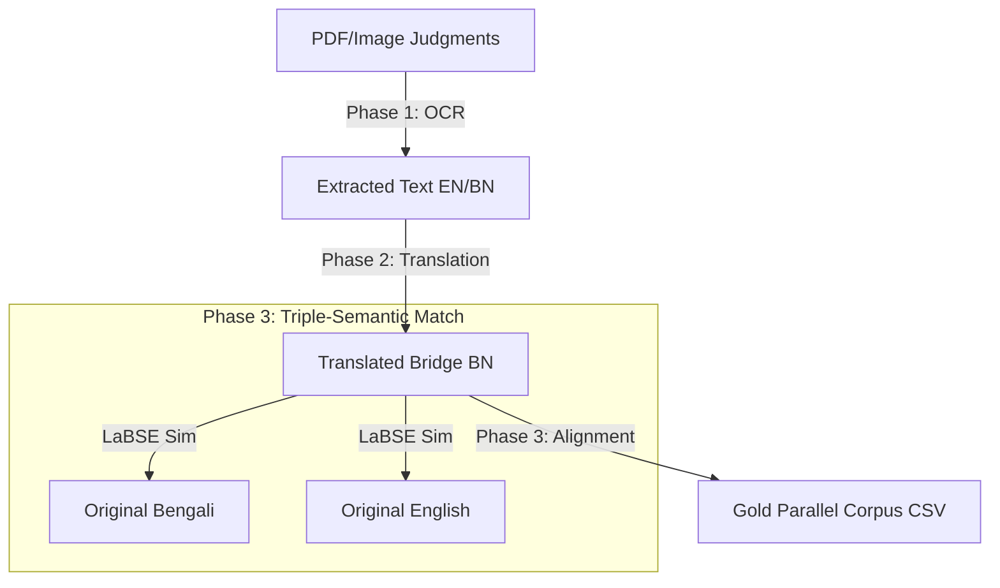

# High-Density Legal Parallel Corpus Pipeline 

A professional-grade, massive-scale pipeline for building gold-standard Bengali-English parallel corpora from legal judgments. This system processed 5,370+ Calcutta High Court judgments using state-of-the-art OCR, NMT, and semantic alignment.

##  Architecture Overview

The pipeline operates in three distinct phases to ensure maximum data density and semantic fidelity.



##  Core Components

### Phase 1: Massive OCR Extraction (`olmocr`)
- **Engine**: Utilizing the `olmocr` toolkit for high-performance legal document OCR.
- **Volume**: 10,742 total documents (English + Bengali pairs).
- **Target**: Accurate extraction of court citations, order numbers, and legal arguments.

### Phase 2: Professional Translation (`IndicTrans2`)
- **Model**: `prajdabre/rotary-indictrans2-indic-en-1B` (RoPE support).
- **Optimization**: Sub-batching (8 sentences/batch) and Flash Attention 2 on RTX 4090 to prevent GPU memory saturation.
- **Purpose**: Translating English sources into a Bengali "Bridge" for high-precision semantic matching.

### Phase 3: Triple-Semantic Alignment (`LaBSE`)
- **Algorithm**: Triple-Match Bridge alignment.
- **Model**: Language-Agnostic BERT Sentence Embedding (LaBSE).
- **Logic**: Matches the Translated Bridge (C) against the Original Bengali (B) to ensure professional legal vocabulary while pairing back to the English Source (A).
- **Details**: See [ALIGNMENT_METHODOLOGY.md](./ALIGNMENT_METHODOLOGY.md).

##  Project Structure

```text
translation_model/
├── data/
│   ├── raw/             # 5,370 EN + 5,370 BN OCR Outputs
│   ├── translated/      # 5,370 Machine-Translated BN Bridge files
│   └── final/           # parallel_corpus_v5_labse_gold.csv (Final Dataset)
├── src/
│   ├── translate_self_log.py  # GPU-Optimized Translation Engine
│   └── monolingual_pairer.py  # V5.0 LaBSE Alignment Script
├── ALIGNMENT_METHODOLOGY.md   # Deep-dive into pairing logic
└── README.md                  # Project documentation (this file)
```

## Dataset Statistics (V5.0 Gold)

| Metric | Value |
| :--- | :--- |
| Total Judgments | 5,370 |
| Total Gold Pairs | 93,266 |
| Matching Model | LaBSE (Sentence-Transformers) |
| Threshold | 0.84 (Average Similarity) |

##  Installation & Usage

### 1. Environment Setup
```bash
conda activate bhasantar_env
pip install -r requirements.txt
```

### 2. Execution Flow
```bash
# Phase 2: Start Translation
python src/translate_self_log.py

# Phase 3: Start Alignment (Requires GPU)
python src/monolingual_pairer.py
```

## 📝 Technical Notes
- **Hardware**: Optimized for NVIDIA RTX 4090 (24GB VRAM).
- **Checkpointing**: Scripts use atomic writes to prevent data loss during long runs.
- **Language Stability**: Uses `indic-nlp-library` for Bengali normalization.

---
*Part of the Bhasantar Legal Translation Initiative.*
