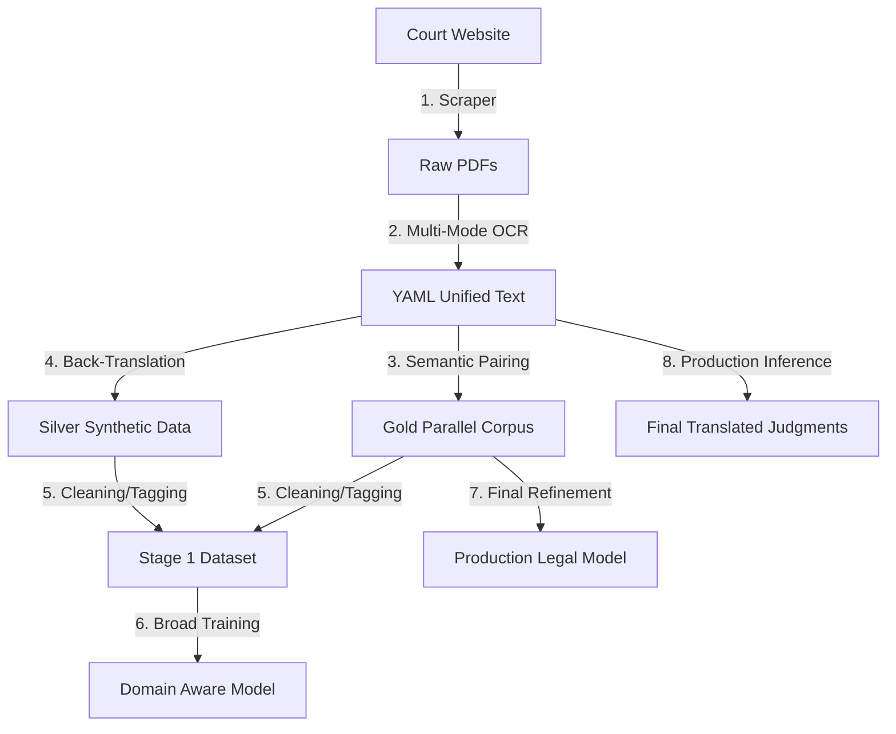

# System Design: Bidirectional IndicTrans2 Translation Pipeline

This document outlines the architecture and training methodology for the **Bidirectional IndicTrans2 (2305.16307)** legal translation system. The system manages both English-to-Bengali and Bengali-to-English directions with specialized legal domain adaptation.

## 🚀 Key Objectives

### 1. Data Augmentation (Phase 1)
- **Back-Translation**: Uses the `src/backtranslate.py` module to generate **272,000 synthetic pairs** from monolingual legal text collected from court judgments.
- **Ratio Alignment**: Achieves a balanced ratio between human-gold data and synthetic-silver data.
- **Tagging**: Implements the mandatory `<BT>` tag to distinguish synthetic "Silver" data from human "Gold" data, ensuring the model treats them with appropriate weights.

### 2. Bidirectional Training Architecture
- **Sequential Multi-Directional Training**: Optimized for single-GPU environments by training two separate 1.1B models sequentially.
- **Model Switching**: The inference engine automatically detects the source language and loads the correct fine-tuned weights.
- **Full-Parameter Fine-tuning**: Moves beyond LoRA to **1.1B full-parameter training** to maximize the model's capacity for complex legal terminology.

### 3. Hyperparameter Synchronization
The training configuration is perfectly aligned with the IndicTrans2 paper:
| Parameter | Value | Purpose |
| :--- | :--- | :--- |
| **Label Smoothing** | 0.1 | Prevents overconfidence during training |
| **Weight Decay** | 0.0001 | Regularization for full-parameter stability |
| **Scheduler** | `inverse_sqrt` | Standard Transformer learning rate decay |
| **Warmup Steps** | 4000 | Graduate initialization for deep layers |
| **Effective Batch Size** | 128 | Optimized via gradient accumulation |

## 🧪 Pipeline verification
- **Process Management**: Managed via `bt_pid.txt` and `pipeline_pid.txt`.
- **Dataset Preparation**: Automated via `src/prepare_dataset.py` which isolates Stage 1 (Combined) and Stage 2 (Gold-only) datasets.
- **Resource Optimization**: Implements `fp16` mixed-precision and gradient checkpointing for hardware efficiency.

## 🗺️ System Architecture & Workflow

The following process map describes the transition from raw court documents to professional translations:

### 1. Extraction & Standardization
- **Hybrid OCR**: Handles both digital PDFs and scanned (including handwritten) judgments.
- **Unified Text**: Converges all raw inputs into a clean, structured YAML format for the training engine.

### 2. Dataset Manufacturing
- **Semantic Alignment (The "Gold" set)**: Employs **LaBSE (Language-Agnostic BERT)** to match Bengali and English sentences below a high-similarity threshold.
- **Data Augmentation (The "Silver" set)**: Generates high-volume synthetic pairs to build broad domain knowledge.

### 3. Two-Stage Training
- **Stage 1 (Domain Awareness)**: Massive training on combined datasets to learn the general "flavor" of legal code and terminology.
- **Stage 2 (Judicial Precision)**: Final refinement on human-only data to remove synthetic noise and lock in high-accuracy judicial phrasing.

### 4. Deployment & Inference
- The production engine accepts YAML structures from any source and outputs high-fidelity legal translations, maintaining document structure and terminology consistency.
